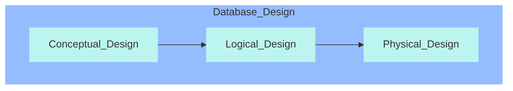

# Intro to Modelling

[PDF](../Lectures/L03 Intro to Modelling S2 2020.pdf)

### Conceptual Deseign

* **High-level**, **first-pass** model of entities and their connections
* Typically omits **attributes**
* Could potentially be implemented in a **non-relational** database
* Thus can include **many- to-many** relationships, repeating groups, composite attributes

* No decision stage
* Case study

---

| Terminology              | Definition                                                   | -                                                            |
| ------------------------ | ------------------------------------------------------------ | ------------------------------------------------------------ |
| Entity                   | An entity is described (in DB) using a set of **attributes**. | attribute, key attribute                                     |
| Entity Set               | A collection of entities of the same types.                  |                                                              |
| Relationship             | Association among two or more entities.                      | can have own arrtibutes                                      |
| Relationship Set         | Collection of relationships of the same type.                |                                                              |
| Key constraints          | Determine the number of objects taking part in the relationship set (How many from each side). | Many-to-Many(M:M), One-to-Many(1:M), One-to-One(1:1)         |
| Participation Constraint | Explores whether all entities of one entity set take part in a relationship. If yes this is a total participation, otherwise it is partical. | total participation (at least one) with **bold line**, partial participation |
| Weak entities            | A weak entity can be identified **uniquely** only by considering (the **primary key** of) another (owner) entity. They are represented as a **bold** rectangle. | only have partial key                                        |
| Ternary Relationships    | In general, we can have **n**-ary relationships, and relationships can have attributes. |                                                              |

* Chen notation key shapes

### Conceptual Design Using the ER Model

* Should a concept be modelled as an **entity** or an **attribute**?

  * If we have **several addresses per employee**, adress must be an entity.

  * If the **structure** (city, street, etc.) **is important**, address should be modeled as an entity.

* Should a concept be modelled as an **entity** or a **relationship**?

  * For me, relationships are like verbs in the content.

* Should we model relationships as **binary, ternary, n-ary**?

### Summary

* Conceptual design follows requirements analysis

  * Yields a high-level description of data to be stored

* ER model popular for conceptual design

  * Constructs are expressive, close to the way people think about their applications
  * Originally proposed by Peter Chen, 1976

  NB: There are many variations on ER model

* Basic constructs

  * Entities
  * Relationships
  * Attrubutes (of entities and relationships)

* Some additional constructs: week entities

  